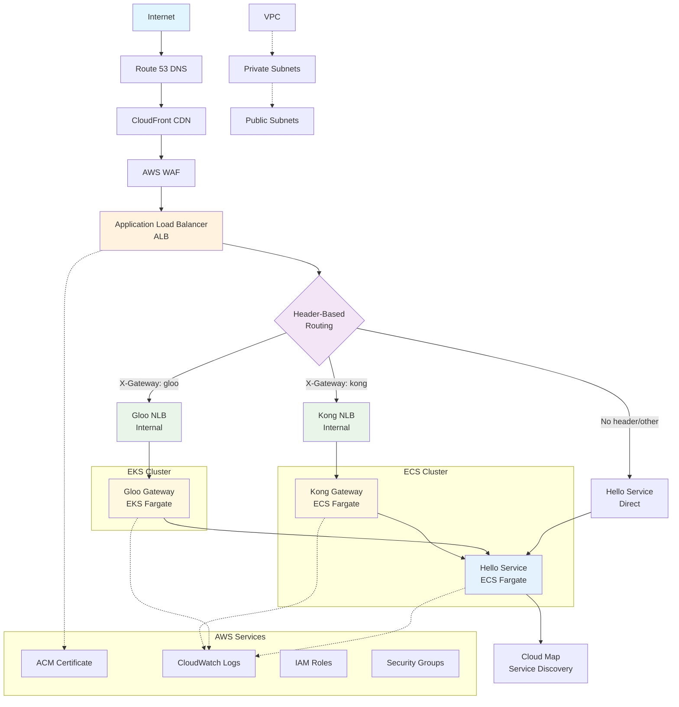

# System Architecture Diagram

## Dual Gateway Architecture - Mermaid Diagram

Below is the Mermaid diagram code for the sbxservice dual-gateway architecture:

## Usage

You can use this Mermaid diagram in:

1. **GitHub/GitLab README files** - Just paste the code block in markdown
2. **Mermaid Live Editor** - Copy the code to [mermaid.live](https://mermaid.live) to edit and export
3. **Documentation tools** - Most modern documentation platforms support Mermaid
4. **Draw.io/Diagrams.net** - Import as Mermaid diagram
5. **VS Code** - Use Mermaid preview extensions

## Diagram Components

### Traffic Flow
- **Internet → Route 53 → CloudFront → WAF → ALB**: External traffic ingress
- **ALB Header Routing**: Distributes traffic based on `X-Gateway` header
- **Gateway Processing**: Kong or Gloo processes requests
- **Backend Connection**: Both gateways connect to shared hello-service

### Infrastructure Layers
- **Public Layer**: ALB, CloudFront, Route 53
- **Gateway Layer**: Kong (ECS) and Gloo (EKS) with their respective NLBs
- **Application Layer**: Hello Service (ECS) with Cloud Map service discovery
- **Support Services**: ACM, CloudWatch, IAM, Security Groups

### Color Coding
- **Blue tones**: Entry points and load balancers
- **Orange tones**: Core routing and decision points  
- **Purple tones**: Routing logic
- **Green tones**: Network load balancers
- **Yellow tones**: Gateway services
- **Light blue**: Backend services