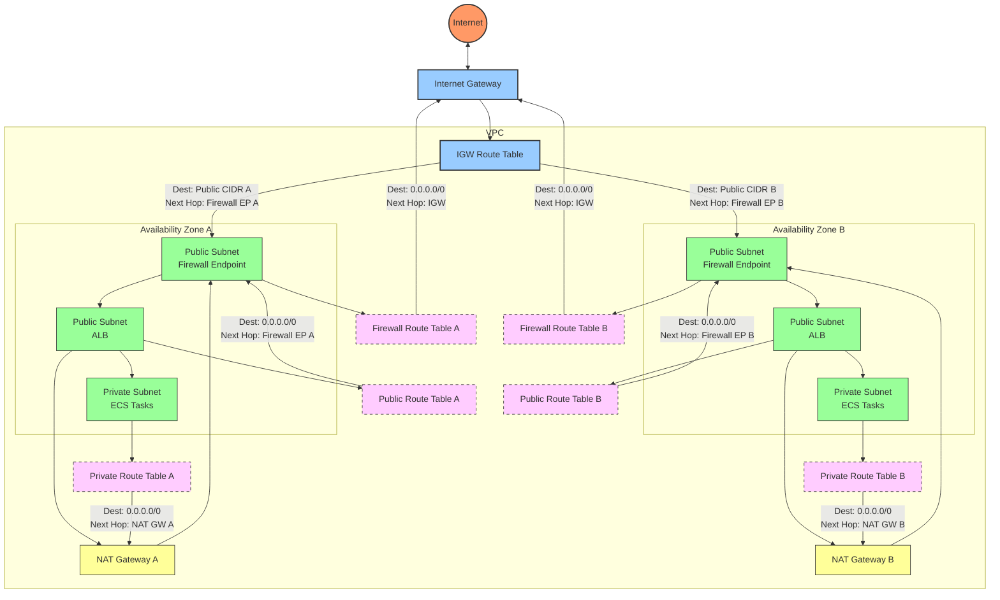

# Network Firewall Architecture

## Updated Architecture (Network Firewall in Public Subnets)

```
                                           VPC
+----------------+     +----------------------------------------------------------+
|                |     |  +----------------+                                      |
|                |     |  | Public Subnet  |                                      |
|                |     |  | (Firewall)     |                                      |
|                |     |  +--------+-------+                                      |
|                |     |           |                                              |
|                |     |           v                                              |
|                |     |  +--------+-------+     +----------------+               |
|                |     |  | Public Subnet  |     | Private Subnet |               |
| Internet       +-----+->| (ALB)          +---->| (ECS Tasks)    |               |
|                |     |  |                |     |                |               |
|                |     |  +----------------+     +----------------+               |
|                |     |                                                          |
+----------------+     +----------------------------------------------------------+

Traffic Flow:
1. Internet -> Internet Gateway
2. Internet Gateway -> Network Firewall (in public subnet)
3. Network Firewall -> ALB (in public subnet)
4. ALB -> Network Firewall -> ECS Tasks (in private subnet)
5. ECS Tasks -> Network Firewall -> ALB (for return traffic)
6. ALB -> Network Firewall -> Internet Gateway -> Internet (for return traffic)
```

## Routing Tables Configuration

### Edge Route Table (Internet Gateway)
- Routes traffic to public subnets through Network Firewall endpoints in the same AZ
- Each public subnet has a specific route through its AZ's firewall endpoint

### Firewall Subnet Route Tables
- Default route (0.0.0.0/0) goes directly to Internet Gateway
- This allows the firewall to communicate with the internet

### Public Subnet Route Tables
- Default route (0.0.0.0/0) goes through Network Firewall endpoints in the same AZ
- This ensures all outbound traffic from public subnets is inspected

### Private Subnet Route Tables
- Default route (0.0.0.0/0) goes to NAT Gateway in the same AZ
- This allows private resources to access the internet via NAT

## Routing Diagram



### Route Table Details

| Route Table | Destination | Next Hop |
|-------------|------------|----------|
| IGW Route Table | Public Subnet CIDR (AZ-A) | Firewall Endpoint (AZ-A) |
| IGW Route Table | Public Subnet CIDR (AZ-B) | Firewall Endpoint (AZ-B) |
| Firewall Route Table | 0.0.0.0/0 | Internet Gateway |
| Public Subnet Route Table | 0.0.0.0/0 | Firewall Endpoint (Same AZ) |
| Private Subnet Route Table | 0.0.0.0/0 | NAT Gateway (Same AZ) |

### Traffic Flow Examples

1. **Inbound Traffic to Public Subnet in AZ-A**:
   Internet → Internet Gateway → IGW Route Table → Firewall Endpoint in AZ-A → ALB in AZ-A

2. **Outbound Traffic from Public Subnet in AZ-A**:
   ALB in AZ-A → Public Subnet Route Table → Firewall Endpoint in AZ-A → Internet Gateway → Internet

3. **Outbound Traffic from Private Subnet in AZ-A**:
   ECS Tasks in AZ-A → Private Subnet Route Table → NAT Gateway in AZ-A → Firewall Endpoint in AZ-A → Internet Gateway → Internet

4. **Cross-AZ Traffic from AZ-A to AZ-B**:
   This traffic follows AWS's default VPC routing and doesn't need special routes.

> Note: Each AZ uses its own Network Firewall endpoint and NAT Gateway for better isolation and performance.

This configuration ensures:
1. All traffic from the internet to public subnets is inspected by the Network Firewall
2. All outbound traffic from public subnets is inspected by the Network Firewall
3. Private resources can access the internet through NAT Gateway
4. Each AZ's traffic uses its own Network Firewall endpoint for better isolation and performance

## Previous Architecture (Network Firewall in Private Subnets)

```
                                           VPC
+----------------+     +----------------------------------------------------------+
|                |     |  +----------------+     +----------------+               |
|                |     |  | Public Subnet  |     | Private Subnet |               |
|                |     |  | (ALB)          +---->| (Firewall)     |               |
|                |     |  |                |     |                |               |
|                |     |  +----------------+     +------+---------+               |
|                |     |                                |                         |
| Internet       +-----+->                              v                         |
|                |     |                         +------+---------+               |
|                |     |                         | Private Subnet |               |
|                |     |                         | (ECS Tasks)    |               |
|                |     |                         |                |               |
+----------------+     |                         +----------------+               |
                       +----------------------------------------------------------+

Traffic Flow:
1. Internet -> Internet Gateway
2. Internet Gateway -> ALB (in public subnet)
3. ALB -> Network Firewall (in private subnet)
4. Network Firewall -> ECS Tasks (in private subnet)
```

## Benefits of the New Architecture

1. **Improved Security**: All traffic from the internet is inspected by the Network Firewall before reaching any application components.
2. **Simplified Routing**: More straightforward traffic flow with the firewall at the edge.
3. **Better Protection**: ALB is now protected by the firewall, reducing the attack surface.
4. **Enhanced Visibility**: All traffic entering the VPC is inspected, providing better visibility into potential threats. 